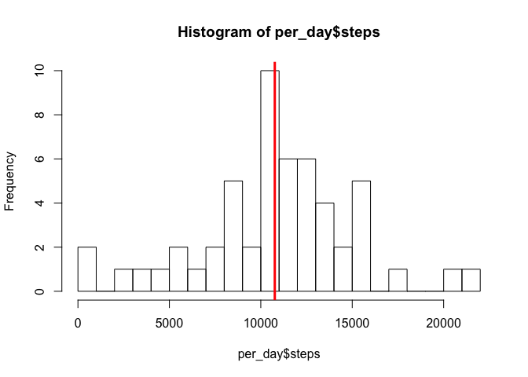
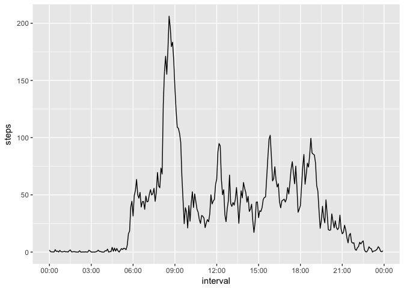
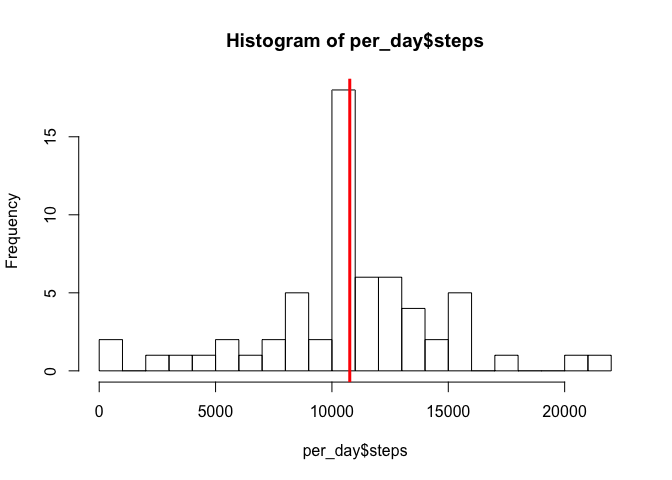
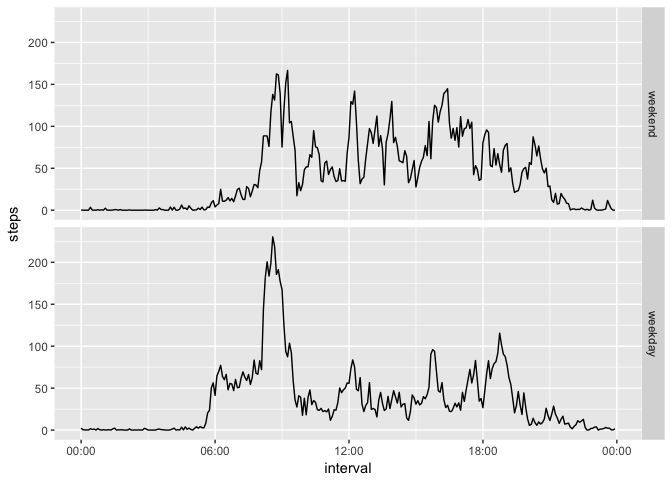

# Reproducible Research: Peer Assessment 1
Andreas Schmidt Jensen  

# Explorations in dataset on activity measured in 5-minute intervals.

First, initialize by loading required libraries.

```r
library(chron)
library(dplyr)
```

```
## Warning: package 'dplyr' was built under R version 3.4.1
```

```
## 
## Attaching package: 'dplyr'
```

```
## The following objects are masked from 'package:stats':
## 
##     filter, lag
```

```
## The following objects are masked from 'package:base':
## 
##     intersect, setdiff, setequal, union
```

```r
library(ggplot2)

# set timezone to UTC to make Chron plot time-series correctly.
Sys.setenv(TZ='UTC')
```

## Loading and preprocessing the data
We read the data-file and convert the `date` column to the type Date, which makes time-based analysis easier.

```r
df <- read.csv("activity.csv", sep=",")
df$date <- as.Date(df$date, "%Y-%m-%d")
df$interval <- times(sub(x=sprintf("%04d", df$interval), pattern='([0-9]{2})([0-9]{2})', replacement='\\1:\\2:00'))
```
We see that the dataframe consists of 17568 rows with 3 variables and provide a brief summary of the data:

```r
str(df)
```

```
## 'data.frame':	17568 obs. of  3 variables:
##  $ steps   : int  NA NA NA NA NA NA NA NA NA NA ...
##  $ date    : Date, format: "2012-10-01" "2012-10-01" ...
##  $ interval:Class 'times'  atomic [1:17568] 0 0.00347 0.00694 0.01042 0.01389 ...
##   .. ..- attr(*, "format")= chr "h:m:s"
```

```r
summary(df)
```

```
##      steps             date               interval       
##  Min.   :  0.00   Min.   :2012-10-01   Min.   :00:00:00  
##  1st Qu.:  0.00   1st Qu.:2012-10-16   1st Qu.:05:58:45  
##  Median :  0.00   Median :2012-10-31   Median :11:57:30  
##  Mean   : 37.38   Mean   :2012-10-31   Mean   :11:57:30  
##  3rd Qu.: 12.00   3rd Qu.:2012-11-15   3rd Qu.:17:56:15  
##  Max.   :806.00   Max.   :2012-11-30   Max.   :23:55:00  
##  NA's   :2304
```

## What is mean total number of steps taken per day?
First, we create a histogram of the total number of steps taken per day. We ignore any missing values.

```r
per_day <- na.omit(df) %>% group_by(date) %>% summarise(steps = sum(steps))
hist(per_day$steps, breaks=20)
abline(v = median(per_day$steps), lwd=3, col="red")
```

<!-- -->
We see that the median seems to be at around 10000 steps (actually plotted as the red line).

We calculate the mean and median total number of steps taken per day:

```r
mean(per_day$steps)
```

```
## [1] 10766.19
```

```r
median(per_day$steps)
```

```
## [1] 10765
```

## What is the average daily activity pattern?
We group the data by each 5-minute interval and calculate the average number of steps for each interval. We ignore any missing values.
This data can then be plotted to show the average daily activity pattern.

```r
per_interval <- na.omit(df) %>% group_by(interval) %>% summarise(steps = mean(steps))
ggplot(per_interval, aes(x = interval, y = steps), xlab="Interval", ylab="Average number of steps") + geom_line() + scale_x_chron(format="%H:%M", n = 10)
```

<!-- -->
We see a peak just before 9:00, but we can extract the actual interval using `which.max`:

```r
per_interval[which.max(per_interval$steps),]
```

```
## # A tibble: 1 x 2
##      interval    steps
##   <S3: times>    <dbl>
## 1    08:35:00 206.1698
```

## Imputing missing values

We see that the dataset has a number of missing values:

```r
sum(is.na(df$steps))
```

```
## [1] 2304
```
This corresponds to quite a large percentage of total values that are missing:

```r
mean(is.na(df$steps))*100
```

```
## [1] 13.11475
```

We impute the missing values using the mean for that specific 5-minute interval.

```r
df.imputed <- df
# simple for-loop going through each row, imputing if the steps-value is missing.
for (i in 1:nrow(df.imputed)) {
  df.imputed[i,"steps"] <- ifelse(is.na(df.imputed[i,"steps"]), per_interval[per_interval$interval==df.imputed[i,"interval"],"steps"], df.imputed[i,"steps"])
}
```

We can now verify that there are no missing values in the dataset.

```r
sum(is.na(df.imputed))
```

```
## [1] 0
```

### Histogram - imputed values
We can create a histogram for the imputed values, to see what the imputation does to the distribution.

```r
per_day <- df.imputed %>% group_by(date) %>% summarise(steps = sum(steps))
hist(per_day$steps,  breaks = 20)
abline(v = median(per_day$steps), lwd=3, col="red")
```

<!-- -->

We see that the median seem to be around the same value as before, but we can calcuate both the median and the mean:

```r
mean(per_day$steps)
```

```
## [1] 10766.19
```

```r
median(per_day$steps)
```

```
## [1] 10766.19
```

We see that mean is actually unchanged but the median has moved a bit. Since we're imputing using the mean, it is not a surprising result.

## Are there differences in activity patterns between weekdays and weekends?
Now let's investigate if there are any difference in activity patterns during the weekdays and in the weekend. We first create a factor-column in the imputed dataset containing either 'weekday' or 'weekend', depending on the date. 

```r
wds <- c('Monday', 'Tuesday', 'Wednesday', 'Thursday', 'Friday')
df.imputed$weekday <- factor((weekdays(df.imputed$date) %in% wds), levels=c(F, T), labels=c('weekend', 'weekday'))
```

We can then create a panel plot to see if there are any differences in the activity patterns.


```r
per_interval <- df.imputed %>% group_by_at(vars(interval, weekday)) %>% summarise(steps = mean(steps))
ggplot(per_interval, aes(x = interval, y = steps), xlab="Interval", ylab="Average number of steps") + 
  geom_line() + 
  scale_x_chron(format="%H:%M") +
  facet_grid(weekday ~ .)
```

<!-- -->

We see that the peak for weekends is lower, but the mean seems to be higher, which we can verify:


```r
mean(per_interval[per_interval$weekday=='weekend',]$steps)
```

```
## [1] 42.3664
```

```r
mean(per_interval[per_interval$weekday=='weekday',]$steps)
```

```
## [1] 35.61058
```
The average number of steps is indeed higher in weekends compared to weekdays.

